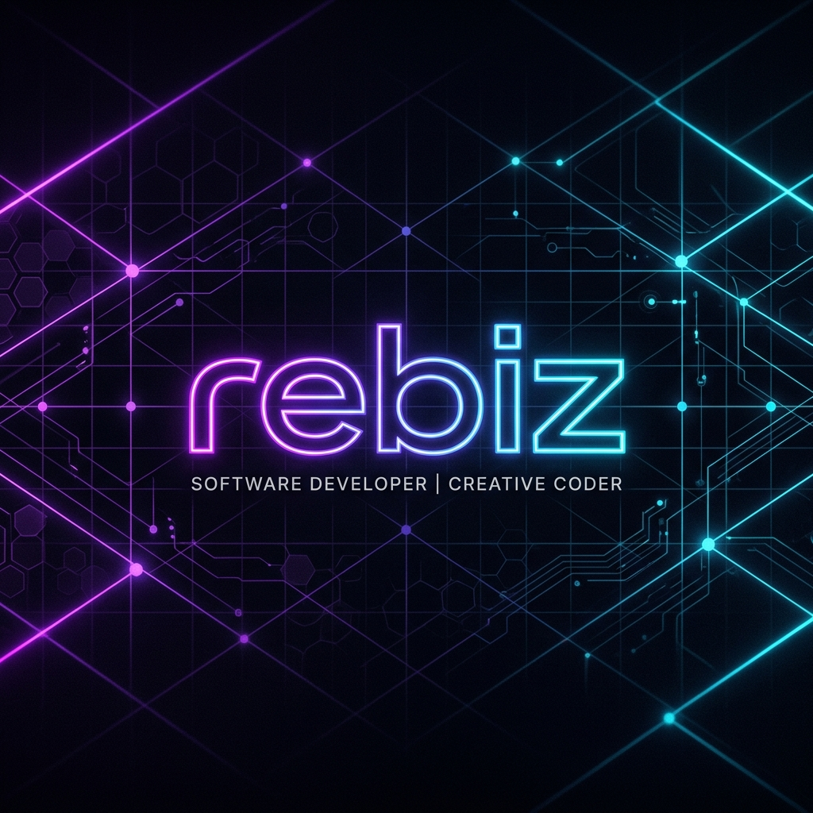

  

<h1 align="center">Hey there! I'm rebiz 👋</h1>

  <i>Creative Coder • NixOS Enthusiast • Automation & Bot Developer</i>

  
  
  

---

### 💫 About Me

* 🛠️ Currently developing **[Noctalia](https://github.com/rebiz-loves-milfs/noctalia)** — a sleek and minimal desktop shell thoughtfully crafted for Wayland.
* 🤖 Building automated pipelines like **[reddit-to-instagram](https://github.com/rebiz-loves-milfs/reddit-to-instagram)** and **[spotify-to-instagram-stories](https://github.com/rebiz-loves-milfs/spotify-to-instagram-stories)**.
* ❄️ Declaring my systems with **[nixos-config](https://codeberg.org/rebiz/nixos-config)**, managing declarative flakes, SOPS-secrets, and custom Wayland environments.

---

### 🛠️ Tech Stack & Tools

  
  
  
  
  
  
  

---

### 📊 GitHub Activity & Stats

  
  

  

